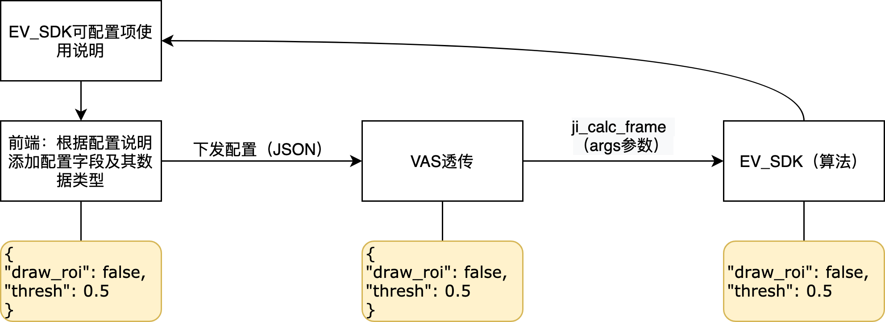

# EV_SDK配置协议

| 版本  | 修订日期 | 版本更新说明                         |
| :-----: | :--------: | :--------------------------: |
| 1.0  | 20201121 | 算法对应配置文件 |
| 2.0  | 20211121 | 增加roi_type字段；统一使用数组对象来描述单个或多个点线框 |

此文档是EV_SDK可配置参数的实现协议说明，**EV_SDK的实现者**（算法开发者）和**EV_SDK使用者**（为EV_SDK生成配置参数）需要遵守此协议。

## 1. 目前SDK配置的使用方法

### 1.1 配置样例

```json
{
    "draw_roi_area": true,
    "roi_color": [255, 255, 0, 0.7],
    "roi_type":"polygon_1",
    "polygon_1": ["POLYGON((0.08 0.1,0.05 0.8,0.8 0.9,0.7 0.05,0.4 0.05))"],
    "roi_line_thickness": 4,
    "roi_fill": false,
    "draw_result": true,

    "warning_text_en": "WARNING! WARNING!"
}
```

### 1.2 数据解析流程




## 2. 协议

### 2.1 格式

配置格式必须遵守[JSON标准格式](http://json.cn/wiki.html)规范。

### 2.2 数据格式定义

- 只能存在一级**KEY-VALUE**变量定义；

- **VALUE**必须是2.3所定义的数据类型；

合法格式示例：

```json
{
  "key1": value1,
  "key2": value2
}
```

其中`value1`和`value2`必须是1.3所定义的数据类型。

不合法格式示例（假定`{"key2": value2}`不是2.3所定义的数据类型）：

```json
{
  "key1": {
    "key2": value2
  },
  "key3": value3
}
```

### 2.3 数据类型

- 所有**JSON**标准定义的非对象类型和非数组类型，如：`string`、`number`、`true`、`false`、`null`；

- `POLYGON`，`LINESTRING`，`POINT`，点线框类型无论单个还是多个，均用数组对象来表示

- 单个多边形类型：符合[WKT格式标准](https://en.wikipedia.org/wiki/Well-known_text_representation_of_geometry)的`POLYGON`字符串，示例：

  ```json
  {
    "polygon_1": ["POLYGON ((30 10, 40 40, 20 40, 10 20, 30 10))"]
  }
  ```
- 多个多边形类型：符合[WKT格式标准](https://en.wikipedia.org/wiki/Well-known_text_representation_of_geometry)的`POLYGON`字符串，示例：

  ```json
  {
    "polygon_1": ["POLYGON ((30 10, 40 40, 20 40, 10 20, 30 10))","POLYGON ((30 10, 40 40, 20 40, 10 20, 30 10))"]
  }
  ```

- 单个线类型：符合[WKT格式标准](https://en.wikipedia.org/wiki/Well-known_text_representation_of_geometry)的`LINESTRING`字符串示例：

  ```json
  {
    "cross_line_1": ["LINESTRING (30 10, 10 30, 40 40)"]
  }
  ```

- 多个线类型：符合[WKT格式标准](https://en.wikipedia.org/wiki/Well-known_text_representation_of_geometry)的`LINESTRING`字符串示例：

  ```json
  {
    "cross_line_1": ["LINESTRING (30 10, 10 30, 40 40)","LINESTRING (30 10, 10 30, 40 40)"]
  }
  ```

- 单个点类型：符合[WKT格式标准](https://en.wikipedia.org/wiki/Well-known_text_representation_of_geometry)的`POINT`字符串示例：

  ```json
  {
    "direction_point_1": ["POINT (30 10)"]
  }
  ```

- 多个点类型：符合[WKT格式标准](https://en.wikipedia.org/wiki/Well-known_text_representation_of_geometry)的`POINT`字符串示例：

  ```json
  {
    "direction_point_1": ["POINT (30 10)","POINT (40 10)"]
  }
  ```


- BGRA颜色类型：BGRA四个数字表示的颜色类型：`[255, 255, 0, 0]`，其中前三个数字分别表示BGR三个颜色通道的值，范围：`[0, 255]`，第四个值表示透明度，范围`[0, 1]`，值越大越透明。

## 3. 注意事项

### 3.1 对于算法开发者

算法开发者在实现过程中，需要注意：

- 遵守以上所定义的协议；

- 需要使用`roi_type`说明支持的点线框类型，保证上层应用读取配置文件后，可以正确地下发算法支持的点线框数据

- 协议提供了目前常用的数据类型，实现过程中可以按照需要使用**KEY**的名称做逻辑区分，例如需要使用多根线类型的情况：

  ```json
  {
    "roi_type":"line_1;line_2",
    "line_1": ["LINESTRING (10 20, 10 30, 40 140)"],
    "line_2": ["LINESTRING (10 5, 10 30, 40 140)"]
  }
  ```

## 4. 扩展

如果协议所定义的数据类型无法满足需要，可以加入新的类型。协议加入新的类型后要求：

- 对于EV_SDK实现者，根据所需扩展类型按照新的协议进行实现，已实现旧协议的EV_SDK无需重新实现新扩展类型；
- 对于EV_SDK使用者，需要按照协议扩展，加入对新实现的类型的支持；

## 5.固定配置要求
SDK需实现以下配置参数

- `roi_type`: roi数据类型
- `polygon_1`：针对图片的感兴趣区域进行分析，如果没有此参数或者此参数解析错误，则ROI默认值为整张图片区域，类型：使用WKT格式表示的字符串数组
- `roi_color`：ROI框的颜色，BGRA浮点型数组格式，BGR三通道的范围是`[0,255]`，第四个元素A是透明度，范围是`[0,1.0]`，值越大，画的框、文字透明度越高；默认：`[0, 255, 0, 0.4]`
- `roi_line_thickness`：ROI线框粗细；默认：`3`
- `roi_fill`：是否使用颜色填充ROI区域，`true`填充，`false`不填充；默认：`false`
- `draw_roi_area`：是否在结果图片或者视频中画出ROI感兴趣区域，`true`画，`false`不画；默认：`true`
- `draw_result`：是否画出检测目标框，`true`画，`false`不画；默认：`true`
- `draw_confidence`：是否将置信度画在框顶部，`true`显示，`false`不显示，默认：`true`，小数点后保留两位
- `object_rect_line_thickness`：目标框的粗细，默认：`3`
- `object_text_color`：目标框顶部文字的颜色，BGRA浮点型数组格式，BGR三通道的范围是`[0,255]`，第四个元素不使用，默认：`[255, 255, 255, 0]`
- `object_text_bg_color`：目标框顶部文字的背景颜色，BGRA浮点型数组格式，BGR三通道的范围是`[0,255]`，第四个元素不使用，默认：`[50, 50, 50, 0]`
- `object_text_size`：目标框顶部文字大小，整形，范围`[1,50]`，默认：`30`
- `draw_warning_text`：是否画报警信息文字，`true`是，`false`否，默认：`true`
- `warning_text`：报警文字，默认：`WARNING!`
- `warning_text_size`：报警文字大小，范围`[1,50]`，默认:`30`
- `warning_text_color`：报警文字颜色，BGRA浮点型数组格式，BGR三通道的范围是`[0,255]`，第四个元素不使用，默认：`[255, 255, 255, 0]`
- `warning_text_bg_color`：报警文字背景颜色，BGRA浮点型数组格式，BGR三通道的范围是`[0,255]`，第四个元素不使用，默认：`[0, 0, 200, 0]`
- `warning_text_left_top`：报警文字左上角坐标，整形数组，格式：`[x, y]`，`x`的范围`[0,width]`，`y`的范围`[0,height]`，默认：`[0, 0]`

```json
{
  "roi_type":"polygon_1",
  "polygon_1": ["POLYGON((0.07878787878787878 0.1575,0.05757575757575758 0.8925,0.8484848484848485 0.9325,0.7742424242424243 0.0875,0.4257575757575758 0.0575))"],
	"draw_roi_area":	true,
	"roi_color":	[255, 255, 0, 0.700000],
	"roi_line_thickness":	4,
	"roi_fill":	false,
  "draw_result":	true,
	"draw_confidence":	true,
	"object_rect_line_thickness":	3,
	"object_text_color":	[255, 255, 255, 0],
	"object_text_bg_color":	[50, 50, 50, 0],
	"object_text_size":	30,
	"draw_warning_text":	true,
	"warning_text":	"WARNING!",
	"warning_text_size":	30,
	"warning_text_color":	[255, 255, 255, 0],
	"warning_text_bg_color":	[0, 0, 200, 0],
	"warning_text_left_top":	[0, 0]
}
```

## 6.特定算法要求

#### 人脸识别算法
需实现以下配置

- `draw_face_id`：是否将人脸id画在框顶部，`true`显示，`false`不显示，默认：`true`
- `draw_face_track_id`:是否将跟踪id画在框顶部，`true`显示，`false`不显示，默认：`true`
- `draw_face_name`:是否将人脸姓名画在框顶部，`true`显示，`false`不显示，默认：`true`
- `front_alarm_threshold`：正侧脸阈值，小于该阈值判断为侧脸，不报警，不输出人脸检测信息；范围：`[0,1]`，默认：`0.65`
- `blur_alarm_threshold`：模糊度阈值，小于该阈值判断为模糊，不报警，不输出人脸检测信息，目前模糊分析未调用，默认值为0
- `illu_alarm_threshold`：光照阈值，小于该阈值判断为光照条件差，不报警，不输出人脸检测信息，默认值为0；范围：`[0,1]
- `detect_object`:报警对象，0识别到白名单里的人报警，1识别到黑名单的人报警，3识别到非黑白名单的人报警，4检测到人报警
- `min_face_size` : 检测的最小人脸分辨率大小，小于该阈值的不检测，默认值是50
- `detect_interval` : 跟踪间隔，两次检测之间间隔跟踪的跟踪次数,默认值是5
- `max_face_num` : 最大检索人脸数，默认10
- `retrieve_num` : 同一个id最大人脸检索次数，用于配置多次检索，默认值为3
- `track_flag` : 单帧识别配置参数，0表示仅识别，1表示识别+跟踪，默认值为0
- `retrieve_threshold` : 检索相似度阈值，小于该阈值则为陌生人，默认值为0.9
- `front_threshold` : 正侧脸阈值，小于该阈值判断为侧脸，不进行识别，默认值为0.9
- `blur_threshold` : 模糊度阈值，小于该阈值判断为模糊，不进行识别，目前模糊分析未调用，默认值为0
- `illu_threshold` : 光照阈值，小于该阈值判断为光照条件差，不进行识别，默认值为0
- `front_weight` : 正侧脸分数在人脸质量分析中的权重，取值为[0，1]，与blur_weight和illu_weight的和为1，默认值为0.9
- `blur_weight` : 模糊分数在人脸质量分析中的权重，取值为[0，1]，与frong_weight和illu_weight的和为1，目前模糊分析未调用，默认值为0
- `illu_weight` : 光照分数在人脸质量分析中的权重，取值为[0，1]，与front_weight和blur_weight的和为1，默认值为0.1
- `white_list_rect_color`：白名单目标框的颜色，BGRA浮点型数组格式，BGR三通道的范围是`[0,255]`，第四个元素是透明度，范围是`[0,1.0]`，值越大，画的框、文字透明度越高
- `black_list_rect_color`：黑名单或陌生人目标框的颜色，BGRA浮点型数组格式，BGR三通道的范围是`[0,255]`，第四个元素是透明度，范围是`[0,1.0]`，值越大，画的框、文字透明度越高

```json
{
	"draw_face_id":	true,
	"draw_face_track_id":true,
  "draw_face_name":true,
  "front_alarm_threshold":0.650000,
  "blur_alarm_threshold":	0.0,
  "illu_alarm_threshold":	0.0,
  "detect_object":4,
  "min_face_size":	50,
  "detect_interval":	5,
  "max_face_num":	10,
  "front_threshold":	0.900000,
  "blur_threshold":	0,
  "illu_threshold":	0,
  "front_weight":	0.900000,
  "blur_weight":	0,
  "illu_weight":	0.100000,
  "retrieve_num":	3,
  "retrieve_threshold":	0.900000,
  "track_flag":	1,
	"white_list_rect_color":	[0, 255, 0, 0],
  "black_list_rect_color":	[0, 0, 255, 0],
}
```

